# Getting Started

## Step 1: Start the Metro Server

```bash
# using npm
npm start
```

## Step 2: Start Application

### For Android

```bash
# using npm
npm run android
```

# Preview

https://drive.google.com/file/d/1d0uvleJCR_QcimDcTr-zLExpa6fdf91r/view?usp=sharing

<table>
  <tr>
    <td>About</td>
     <td>Stats</td>
     <td>Evolution</td>
  </tr>
  <tr>
    <td>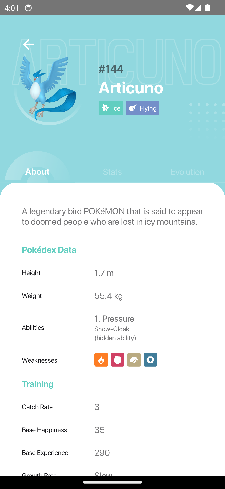</td> 
    <td>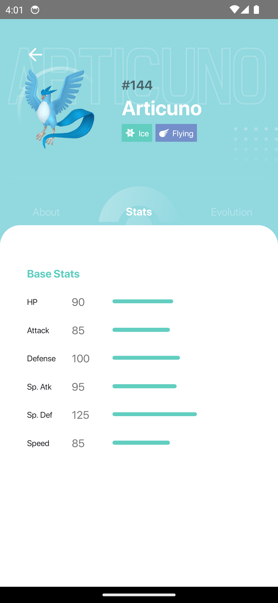</td> 
    <td>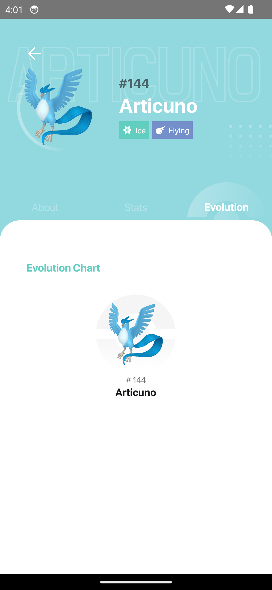</td>  
  </tr>
 </table>

 <table>
  <tr>
    <td>About</td>
     <td>Stats</td>
     <td>Evolution</td>
  </tr>
  <tr>
    <td>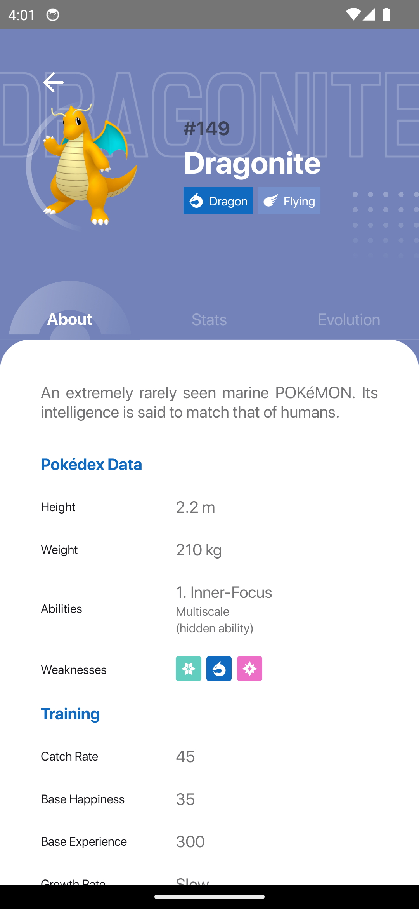</td> 
    <td>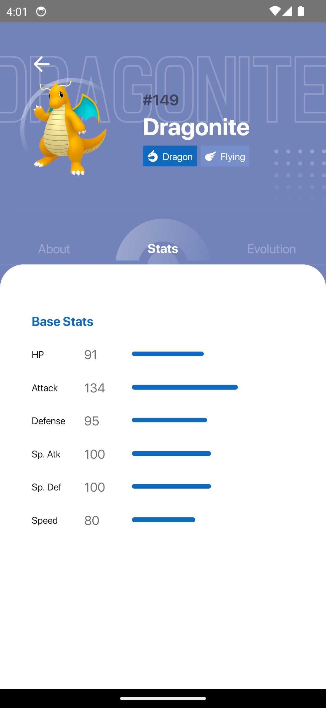</td> 
    <td>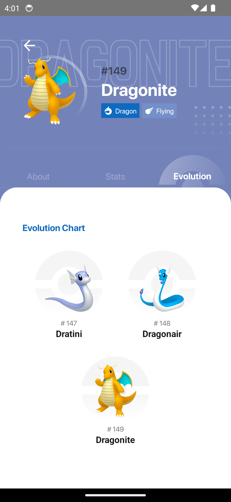</td>  
  </tr>
 </table>

 <table>
  <tr>
    <td>About</td>
     <td>Stats</td>
     <td>Evolution</td>
  </tr>
  <tr>
    <td>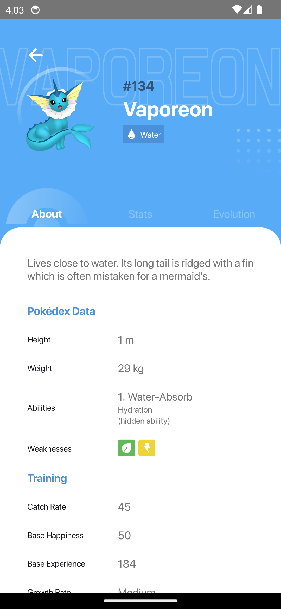</td> 
    <td>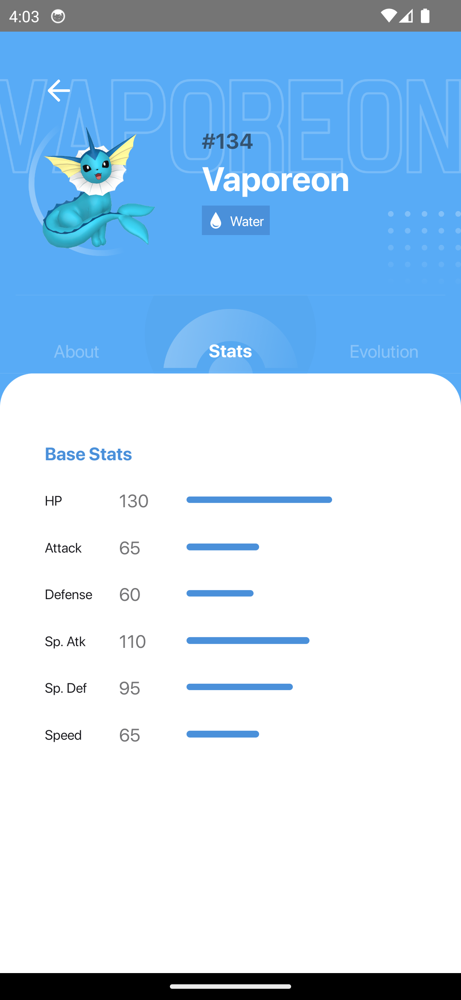</td> 
    <td>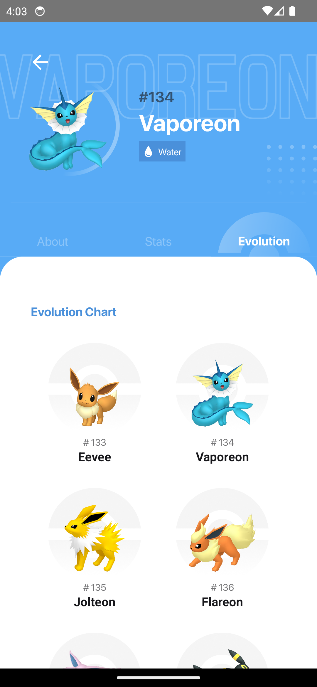</td>  
  </tr>
 </table>

  <table>
  <tr>
    <td>Home</td>
     <td>Home</td>
     <td>Home</td>
  </tr>
  <tr>
    <td>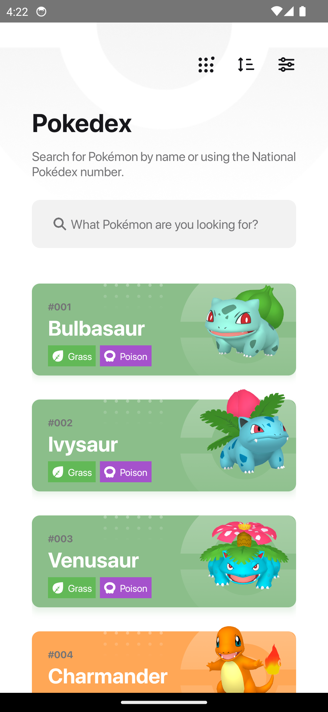</td> 
    <td>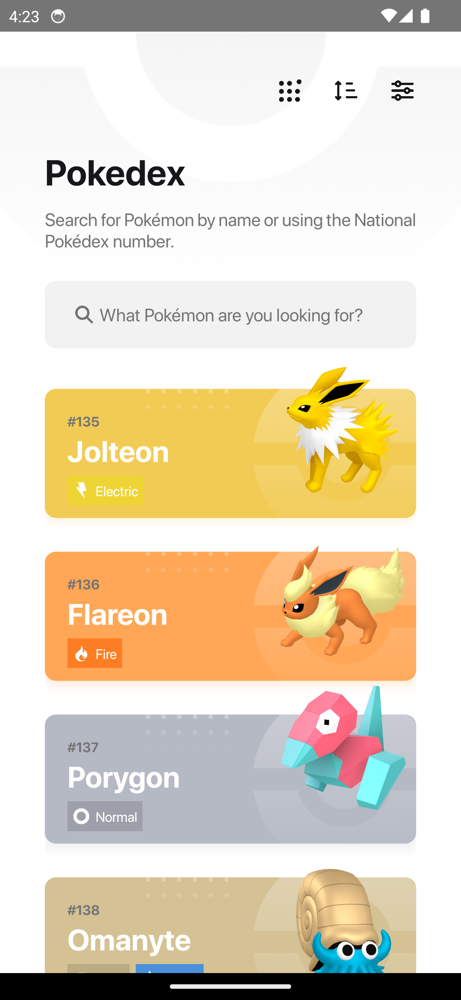</td> 
    <td>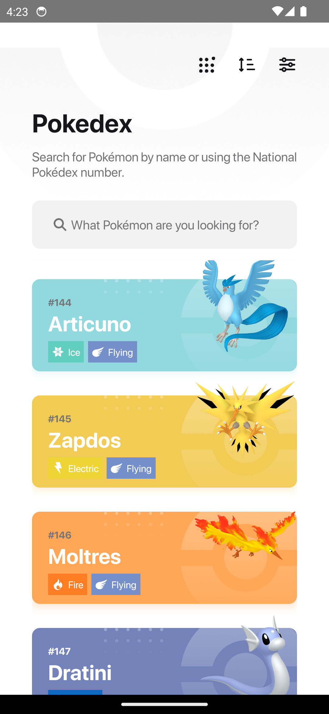</td>  
  </tr>
 </table>
